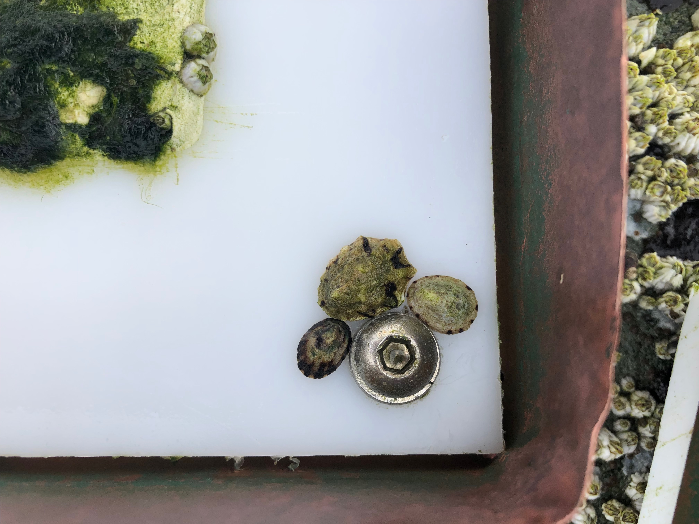
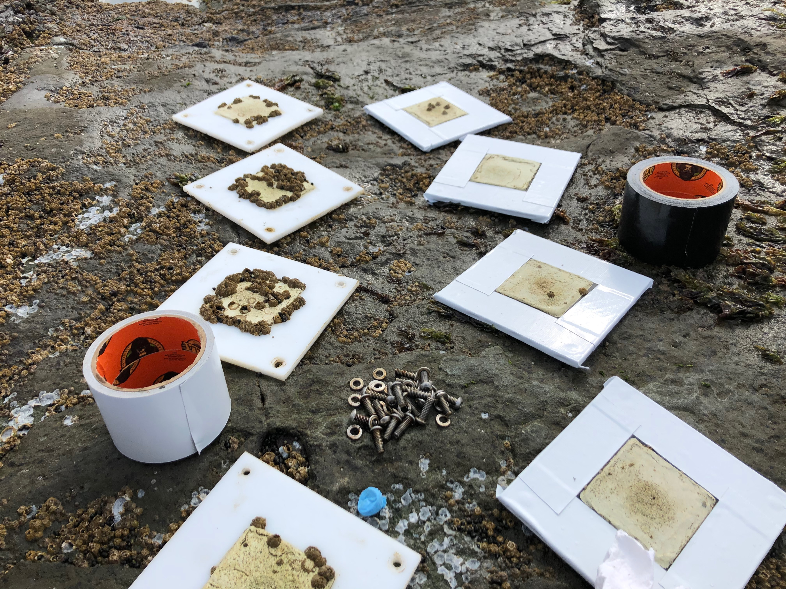

## Questions

This experiment set out to test how temperature shapes the composition
of intertidal barnacle bed communities, asking the question: how do
single vs. successive hot summers affect this same community?

## Hypotheses

1.  Barnacle bed communities that are exposed to hotter temperatures
    during summer, even for a single year, will have lower diversity
    (species richness, Shannon-Weiner diversity, evenness, beta
    diversity) than those that are exposed to ambient/cooler conditions
    during the same period.

2.  Warming will exert a persistent effect through time (i.e., warming
    in year one will stil affect communities in year two) mediated by
    changes in the cover of biogenic habitat.

3.  Previously 'cool' communities, since they have more established,
    larger barnacle beds with a more diverse array of microhabitats and
    thermal refugia, will be less perturbed by warming than previously
    'warm' communities that have less structurally complex biogenic
    habitat. That is, the effect of warming in year two will be
    contigent upon warming in year one.

## Materials & Methods

#### Site description

This experiment was completed at Ruckle Provincial Park on the
southeast-facing, semi-exposed sandstone shore of Salt Spring Island,
located in British Columbia within the Salish Sea. Relative to the rest
of the southern Gulf Islands, this site receives more substantial wave
exposure and cooler, saltier water, being positioned more towards the
Strait of Juan de Fuca and away from the Fraser River plume. Thus, the
intertidal community at this site is substantially more diverse than
neighbouring islands. However, like the rest of the Gulf Islands, this
island's intertidal zone is a "hot spot" in the region due to its
mid-day summer low tides coupled with relatively clear, sunny weather
during the summer.

The upper intertidal zone at this site is dominated by acorn barnacles
(*Balanus glandula* and *Chthamalus dalli*), with sporadic beds of the
perennial brown alga *Fucus distichus* and patches of the crustose phase
of *Mastocarpus* sp.. Ephemeral algae can be found primarily in the
winter when temperatures less stressful, namely the green ephemeral
species *Ulothrix* sp. and *Ulva* sp., the red alga *Pyropia* sp., and
the brown alga *Petalonia fascia*. Herbivores are relatively plentiful
at this shore level, though some more thermally sensitive species
migrate down shore with the onset of summer temperatures (Hesketh,
personal observation). These include the littorine snails *Littorina
scutulata* and *L. sitkana* and the limpets *Lottia paradigitalis* and
congeners *L. digitalis*, *L. pelta*, and *L. scutum*.

 

#### Experimental design

Measurements in this experiment were made at the level of individual
tiles deployed in the intertidal zone (Fig. 1). These tiles were
manufactured as in previous studies employing the same passive warming
method (@kordas2015). In short, tiles consisted of two units made from
high-density polyethylene (HDPE) plastic, a lower unit composed of
thicker white HDPE (9.5 mm) anchoring the tile to the underlying
bedrock, and an upper unit made of thinner HDPE (6.4 mm) that was either
white (cool temperature treatment) or black (warm temperature
treatment). A thin layer of Sea Goin' poxy putty (Permalite Plastics)
was spread in the central 6.9 x 6.9 cm area of the top unit to generate
a settlement surface. To enhance the fine-scale heterogeneity of the
surface, finely ground epsom salts were pressed into the putty as it
dried, and dissolved with water after drying to leave behind fine pock
marks. When tile colour was altered for a subset of tiles during the
second year of the study, this was accomplished using heavy-duty tape,
either white or black in colour (Gorilla Tape), with adhesion enhanced
by the application of super glue.

 

{width="400"}

**Figure 1.** Experimental tiles deployed at Ruckle Provincial Park,
Salt Spring Island, pictured one year after their initial installation
on shore. Recruitment and growth of algae and barnacles is evident in
the central settlement area of each tile, while the outer black or white
area of each tile serves to passively generate the warm and cool
treatments used during this experiment, respectively.

 

The experiment followed a stratified random design, which went through
several iterations as the original herbivore manipulation changed in
response to methodological complications, and then again after the final
question changed.

1.  **Original herbivory x warming design (March - June 2019):** In this
    design, we had five blocks of 20 tiles each, half of which were
    white and half of which were black. Copper fences were installed
    along the perimeter of each tile (0.511 mm thick, 3.8 cm high above
    the level of the tile). Each of these ten tiles had a different
    herbivore treatment applied: no herbivores, *L. paradigitalis*
    alone, *L. digitalis* alone, *L. scutulata* alone, *L. sitkana*
    alone, each two-way combination of herbivores, and all herbivores.
    Prior to treatments, we dissected a number of individuals of each
    species to determine the species-specific relationship between wet
    and dry tissue weight for each. Thus, when applying herbivores to
    the tiles, we attempted to standardize wet weight to \~120 mg of dry
    tissue weight per tile. Thus, there was one replicate of each
    treatment per tile, n=5 across all blocks.
2.  **Updated herbivory x warming design (June 2019 - August 2019):**
    For this design, tiles were moved to new locations to avoid log
    damage, log-damaged tiles were removed, and littorine snails were
    removed from the herbivore treatment pool since they were dislodged
    or appeared in treatments randomly due to wave action. This resulted
    in a new design of six experimental blocks with 16 tiles each, eight
    of which were black and eight of which were white. Only limpets were
    used in the herbivory treatments (Fig. 2), of which there were
    eight: no herbivores, *L. paradigitalis* alone, *L. digitalis*
    alone, *L. scutum* alone, each of the three two-species combinations
    of these, and all species. Thus, there was again a sample size of
    five per treatment, one replicate per block.

 

{width="425"}

**Figure 2.** Stage 2 of experimental herbivore additions. Pictured
here: *L. digitalis* (large, ribbed limpet) and *L. paradigitalis*
(small limpets) added to a cool treatment tile in July 2019.

 

3.  **Final design (August 2019-February 2021):** While the limpet
    manipulation worked reasonably well for *L. paradigitalis*, the
    other two limpet species more often than not died within two weeks
    of being added to tiles, presumably due to heat stress. What limpets
    of these species did survive were often found at the edges of the
    tile units, or wedged in the crack between the tile and copper
    fence, signaling that their grazing activity on the tile may be
    minimal. Thus, at this point the copper fences were removed from all
    tiles, and herbivores of all species were allowed to access and
    leave tiles freely. In April 2020, the colour of half of these tiles
    were changed (white -\> black or black -\> white), while half were
    left unaltered (Fig. 3). This resulted in four treatments
    (cool-cool: CC; warm-warm: WW; cool-warm: CW; and warm-cool: WC)
    with a final sample size of 20 tiles per treatment (four per
    experimental block, five blocks). Some tiles were lost from this
    intended final number due to log damage and wave dislodgement.

 

{width="425"}

**Figure 3.** Stage 3 of the experimental design, when the decision was
made to alter temperature for a subset of experimental tiles using
heavy-duty tape. Pictured here: cool temperature tiles that were left
unaltered between experiment years (CC treatment, left) and previously
warm temperature tiles covered with heavy-duty white tape (WC treatment,
right). Differences in barnacle cover after the first year are quite
evident in this photograph.

 

Temperature was monitored in each experimental temperature treatment
using iButton temperature loggers (Maxim Integrated) embedded between
the upper and lower units of tiles.

 

#### Diversity surveys

Visual surveys were performed at monthly intervals during summer and
every two months during winter from April 2019 (one month after
experiment installation) to February 2021. During these, each species
was identified and enumerated --- in the case of invertebrates --- or
their percent cover measured --- in the case of algae. Organisms were
identified down to species, or in cases where this was unclear (i.e. for
amphipod and isopod crustaceans), coarser taxonomic measures were
instead employed. Sessile species were only measured within the central
6 x 6 cm area with the aid of a small wire quadrat, while mobile species
were enumerated on the entire upper face of the tile.

Tiles were destructively sampled to record the diversity of meiofauna in
September 2020 (after summer heat stress) and in February 2021 (to allow
for winter recovery). Barnacles and associated fauna were scraped from
experimental tile's settlement area and identified to species (where
possible) and counted under a dissecting microscope.

 

## Data dictionary

 

#### Raw data

*/design*

**SVSWS_daylight_hours_pst.rtf**: This raw text file includes sunset and
sunrise times for the entire duration of the experiment, for the exact
lat/long of the field experiment, using the National Research Council of
Canada Sunrise/Sunset calculator
(<https://nrc.canada.ca/en/research-development/products-services/software-applications/sun-calculator/>)

**SVSWS_species_conversions.csv**: These tabular data allow conversion
between shorthand species/taxon notation in survey data and actual
scientific names

-   sp_abbrev: shorthand species abbreviation

-   species_full: scientific name of taxon

**SVSWS_survey_times.csv**: These tabular data associate survey
identifier (key) with the date surveys occurred on.

-   date: YYYY-MM-DD, date of survey

-   survey_no: survey number, a key to associate with other dataframes

**SVSWS_tides.csv**: These tabular data contain tide predictions for
Fulford Harbor, BC, the nearest tide station to the field site.

-   column 1: YYYY-MM-DD, date associated with tide prediction

-    column 2: HH:MM, 24 hour time associated with tide prediction

-   column 3: either PST or PDT, time zone associated with tide
    prediction

-   column 4: predicted level of tide in metres, relative to Canadian
    chart datum

**SVSWS_tilelevels.csv**: Estimated height of individual tiles, as
approximated by temperature traces for rapidly rising summer tides.

-   new_block: block associated with individual tile

-   new_number: number associated with individual tile, within the given
    experimental block

-   tile_height_1, 2 and 3: three numeric estimates of the shore level
    of the tile above Canadian chart datum.

**SVSWS_tilesetup.csv**: Information related to the placement of tiles
and design considerations (e.g., treatment in year one and year two)

-   original_block: Original block (letter, A-E), prior to change in
    design to six blocks in response to log damage (occurred June 2019)

-   original_no: Original number (integer, 1-20), prior to change in
    design to six blocks in response to log damage (occurred June 2019)

-   original_angle: In degrees, numeric angle of tile relative to a flat
    surface (0º), prior to change in design to five blocks in response
    to log damage (occurred June 2019)

-   original_herb_trt: Original herbivore manipulation attempted,
    abandoned in August 2019. ldig = Lottia digitalis, lpdig = Lottia
    paradigitalis, lsc = Littorina scutulata, lsi, Littorina sitkana, NA
    = control

-   original_shore_level: Original shore level (numeric, in metres)
    relative to Canadian chart datum, prior to change in design to five
    blocks in response to log damage (occurred June 2019)

-   new_block: Final block (letter, A-F), after change in design to six
    blocks -new_no: Final number (letter, 1-16), after change in design
    to six blocks

-   new_angle: In degrees, numeric angle of tile relative to a flat
    surface (0º), after change in design to five blocks

-   new_compass: In degrees, compass direction towards which tile
    surface was oriented after change in design to five blocks

-   new_shore_level: Shore level (numeric, in metres) relative to
    Canadian chart datum, after change in design to five blocks. Shore
    levels are very rough, as only a few per block were measured using a
    laser level. See SVSWS_tilelevels.csv for more accurate estimates.

-   colour_y1: Color of tile (white or black) during year one of the
    experiment (prior to 3 April 2020)

-   colour_y2: Color of tile (white or black) during year two of the
    experiment (after 3 April 2020)

-   survived: Did the tile persist through the entire experiment (y/n)?

-   treatment: Code representing the thermal history treatment of each
    tile, either C or W (if tile did not persist until year two), or CC,
    CW, WC, or WW.

-   tile_id: Unique numeric identifier associated with each tile, used
    as key to associate with other dataframes.

 

*/epifauna*

**SVSWS_20200914_epifauna.csv**: Epifauna data obtained from destructive
sampling in September 2020

-    block: same as new_block in SVSWS_tilesetup.csv, experimental block
    (A-F) in which tile was located

-   number: same as new_number in SVSWS_tilesetup.csv, identifying
    number within block of the tile sampled

-   taxon: name of taxon identified within epifauna sample

-   abund: integer, abundance of organisms within the identified taxon

-   notes: observations or caveats associated with identification
    process

**SVSWS_20210224_epifauna.csv**: Same as above, for destructive sampling
that occurred in Feburary 2021.

**taxonomic_codes.csv**: Tabular data for repairing and unifying
taxonomic categories

-   taxon: originally identified taxon

-   sp_code: original four-five character alphanumeric code

-   taxon_repaired: corrected spelling/identification or unified name
    for similar lumped taxa

-   unified_code: code derived from corrected/unified taxon

 

*/temperature*

These tabular files are all labeled as SVSWS_block_number_temp_date.csv
and contain hourly (or every-two-hourly) temperature data recorded by
embedded iButton loggers within tiles or on adjacent bedrock.

-   block: the experimental block where the tile was located, either the
    old or new block within SVSWS_tilesetup.csv depending on the date of
    collection

-   number: the tile's unique identifyin number within the experimental
    block, either the old or new number within SVSWS_tilesetup.csv
    depending on the date of collection

-   date: the date on which the temeperature logger was retrieved

Each file has the same basic structure. There is a descriptive header
containing information about the time of mission start and end. The data
to be extracted are contained within three columns.

Date/Time: The date and time associated with each logged temperature, in
format DD/MM/YY HH:MM:SS. Time is 12-hour, with either AM or PM
following.

Unit: The unit of temperatures collected, always C for degrees Celsius

Value: Numeric data, the recorded temperature in degrees Celsius

 

 

*/tile_surveys*

**SVSWS_barnacle_recruit.csv**: These tabular data contain abundance
data for barnacles, both recruits and adults, beginning in June 2020
when we began to distinguish between adults and recruits.

-   block: Experimental block in which tile was located (same as
    new_block in SVSWS_tilesetup.csv)

-   number: Number of tile identifying it within the experimental block
    (same as new_block in SVSWS_tilesetup.csv)

-   species: Species of barnacle identified, either B. glandula or C.
    dalli

-   size: Either adult or recruit

-   count: Integer, number of barnacles within species and size category
    that were counted on the tile surface.

-   date: Date, format YYYY-MM-DD, of tile survey

**SVSWS_surveys.csv**: Contain all other data resulting from visual
surveys of tile surfaces date:

-   block: the experimental block where the tile was located, either the
    old or new block within SVSWS_tilesetup.csv depending on the date of
    collection

-   number: the tile's unique identifyin number within the experimental
    block, either the old or new number within SVSWS_tilesetup.csv
    depending on the date of collection

-   species: More properly taxon, the name of the identified organism

-   count: Integer value, for invertebrates species only, the number of
    individuals counted on the tile surface.

-   percent_cover: Numeric value, for algal species only, the percentage
    of the tile surface covered by the observed taxon.

-   notes: observations or caveats associated with identification
    process

 

#### Clean data

 

**SVSWS_epifauna_clean.csv**: Data associated with destructive sampling

-   date: Date of sample collection, format YYYY-MM-DD

-   block: same as new_block in SVSWS_tilesetup.csv, experimental block
    (A-E) in which tile was located

-   number: same as new_number in SVSWS_tilesetup.csv, identifying
    number (1-16) of the tile sampled within each block

-   taxon: name of taxon, after being repaired

-   total_abund: integer, total abundance of taxon within sample

-   treatment: treatment, one of CC, CW, WC, or WW, of the tile sampled

-   tile_id: unique identifier for tile based on the combination of
    block and number

**SVSWS_species_list.csv**: Tabular data dividing taxa observed into
invertebrate and algal categories for analyses of diversity

-   species: more properly, taxon, observed during visual survey

-   type: one of alga or invertebrate, used to filter observations

**SVSWS_survey_clean.csv**: Tabular data associated with visual surveys,
now tidy -tile_id: Unique identifier of the tile surveyed

-   survey_no: Unique identifier of the survey where the observation was
    recorded

-   species: more properly, taxon, identified during visual survey

-   count: for invertebrates, the number of individuals observed

-   percent_cover: for algae, the percentage cover of the taxon on the
    settlement surface

-   block: the experimental block where the observation was recorded,at
    the time of the survey (letter, A-F)

-   original_herb_trt: the original herbivore treatment applied during
    early manipulations (April to August 2019). Either ldig (Lottia
    digitalis), lpdig (Lottia paradigitalis), lsc (Littorina scutulata),
    lsi (Littorina sitkana), a combination thereof, or NA (control)

-   angle: the angle of the tile surface in degrees relative to a flat
    surface (0º) at the time of the survey

-   new_compass: the compass bearing faced by the tile surface at the
    time of the survey

-   shore_level: the approximate shore level of the tile's settlement
    surface, reported in metres above Canadian chart datum

-   treatment: thermal history treatment (across both years)

-   trt_y1: temperature treatment during year one of the experiment (C
    or W)

-   trt_y2: temperature treatment during year two of the experiment (CC,
    CW, WC, or WW)

-   notes: any notes associated with the abundance/percentage cover
    observation

**SVSWS_temp_clean.csv**: Tabular data containing all temperatures
recorded by embedded iButton temperature loggers.

-   block: experimental block in which tile was located at the time of
    recording -number: number of block within the experimental block
    where tile was located at the time of recording

-   date_time: the date and time associated with a given temperature
    recording, format YYYY-DD-MM HH:MM:SS, with time in 24-hour format,
    rounded to the nearest hour.

-   collect_date: the date on which iButton was collected from the field
    for temperature readings

-   date: the date on which the temperature was recorded, extracted from
    date_time, format YYYY-MM-DD

-   temp: numeric, in degrees Celsius, temperature of tile surface

-   new_no: the number of the given tile within its experimental block,
    following change in design to six blocks

-   new_block: the experimental block in which the tile was located,
    following change in design to six blocks

-   original_no: the number of the given tile within its experimental
    block, before the change in design to six blocks

-   original_block: the experimental block in which the tile was
    located, before the change in design to six blocks

-   original_shore_level: the original shore level, in m, of the tile
    before the change in design to six blocks, in metres above Canadian
    chart datum.

-   new_shore_level: the new shore level, in m, of the tile after the
    change in design to six blocks, in metres above Canadian chart
    datum. These values are very approximate; see
    raw_data/design/SVSWS_tilelevels.csv for better values. -treatment:
    thermal history treatment (across both years)

-   tile_id: unique identifier associated with the individual tile for
    which temperature was recorded

-   trt_y1: temperature treatment during year one of the experiment (C
    or W or Rock)

-   trt_y2: temperature treatment during year two of the experiment (CC,
    CW, WC, WW, or Rock)

**SVSWS_tile_treatments.csv**: Tabular data containing details related
to study design and tile attributes

-   tile_id: Unique identifier of the tile surveyed

-   survey_no: Unique identifier of the survey where the observation was
    recorded

-   block: the experimental block where the observation was recorded,at
    the time of the survey (letter, A-F)

-   original_herb_trt: the original herbivore treatment applied during
    early manipulations (April to August 2019). Either ldig (Lottia
    digitalis), lpdig (Lottia paradigitalis), lsc (Littorina scutulata),
    lsi (Littorina sitkana), a combination thereof, or NA (control)

-   angle: the angle of the tile surface in degrees relative to a flat
    surface (0º) at the time of the survey

-   new_compass: the compass bearing faced by the tile surface at the
    time of the survey

-   shore_level: the approximate shore level of the tile's settlement
    surface, reported in metres above Canadian chart datum -treatment:
    thermal history treatment (across both years)

-   trt_y1: temperature treatment during year one of the experiment (C
    or W)

-   trt_y2: temperature treatment during year two of the experiment (CC,
    CW, WC, or WW)

-   notes: any notes associated with the tile at the time of a given
    survey

## Acknowledgements

This work was conducted on the traditional territories of the Coast
Salish peoples, to whom we extend our thanks. We thank Ruckle Provincial
Park managers for allowing us access to the shore. Thanks also to S.
Blain, A. Holland, and G. Brownlee for their assistance with field work,
and R. Germain, C. Brauner, and S. Dudas for feedback on analysis.
Funding for this work was generously supplied by the National Geographic
Society through an Early Career research grant. Stipend support was
provided by the National Science and Engineering Research Council and
Canadian Healthy Oceans Network. The groundwork for this study was laid
by R. Kordas, to whom we are indebted for this genius system for doing
thermal manipulations in the high intertidal zone.

## References
